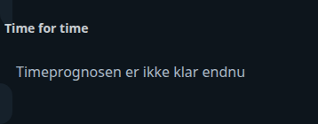

# Hourly Weather Scroll Card

Alle vejr-SVG'er er indlejret i `hourly-weather-scroll-card-assets.js`, som HACS downloader sammen med hovedkortet. Ved manuel installation skal begge JavaScript-filer kopieres til samme mappe; en separat `/local/weathericon`-mappe er ikke nødvendig.

## Neutral mobile preview



> Rendered at 390 px mobile width with fictional Home Assistant entities and values. No private dashboard, person, address, camera, or sensor data is included.


Kompakt, ikke-klikbar time-for-time vejrudsigt du kan trække vandret igennem (mus eller touch), i stedet for et fast antal synlige timer. Læser `attributes.hourly_forecast` fra en vejr-sensor.

```yaml
type: custom:hourly-weather-scroll-card
entity: sensor.weather_forecast
```

## Forventet dataformat

`attributes.hourly_forecast` skal være et array af timevarsler (temperatur, nedbørssandsynlighed, ikon/tilstand osv.) — det format de fleste danske vejr-integrationer (fx DMI/Met.no via Home Assistants indbyggede `weather`-forecast-service, spejlet ind i en sensor) leverer.

## Config

| Felt | Type | Standard |
|---|---|---|
| `entity` | entity-id | `sensor.weather_forecast` |

## Installation

1. Kopiér `hourly-weather-scroll-card.js` til `/config/www/`.
2. Tilføj som Lovelace-resource: `/local/hourly-weather-scroll-card.js?v=1`, type `module`.
3. Tilføj kortet med din egen `entity`.
